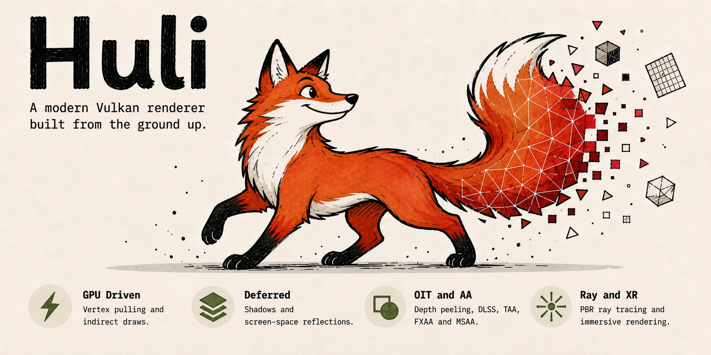

<div align="center">

<p align="center">
  
</p>

# 🦊 Huli — Vulkan 图形编程实践

<p align="center">
  <a href="https://github.com/michaelchern/Huli/stargazers">
    
  </a>
  <a href="https://github.com/michaelchern/Huli/network/members">
    
  </a>
  <a href="https://github.com/michaelchern/Huli/issues">
    
  </a>
  <a href="LICENSE">
    
  </a>
</p>

<p align="center">
  <strong>深入 Vulkan 图形管线 | 从零构建现代渲染引擎</strong>
</p>

</div>

---

一个使用 C++20 探索现代 Vulkan 图形技术的个人学习与实验仓库。

项目从 Vulkan 基础设施与桌面示例开始，逐步实践 GPU 驱动渲染、延迟着色、顺序无关透明、抗锯齿、光线追踪与 VR 渲染等现代图形技术。当前根 CMake 工程已接入 `huli_vulkan`、`huli_render` 和桌面示例 `huli_example1`；后续实验会随着学习进度逐步加入。

- [🚀 项目目标](#项目目标)
- [🗂️ 仓库结构](#仓库结构)
- [💻 环境与构建](#环境与构建)
- [📋 模块进度](#模块进度)
- [✍️ 笔记与备忘](#笔记与备忘)
- [📄 许可与声明](#许可与声明)

## 项目目标

本仓库旨在通过亲手实现，深入理解 Vulkan API 的核心概念与现代图形管线，主要关注以下方向：

- **高性能渲染管线**：可编程顶点拉取、多重间接绘制、无绑定资源访问
- **GPU 驱动渲染**：将场景管理、可见性判断与绘制命令生成交由 GPU 完成
- **延迟渲染与屏幕空间效果**：延迟着色、SSAO、屏幕空间反射与阴影
- **顺序无关透明（OIT）**：深度剥离、链表 OIT、加权混合 OIT
- **抗锯齿方案**：MSAA、TAA、FXAA 及超采样技术实践
- **实时光线追踪**：基于 Vulkan Ray Tracing 扩展构建 PBR 渲染管线
- **虚拟现实渲染**：集成 OpenXR，并探索注视点渲染等性能优化方案

各实验模块计划按相对独立、可单独运行的方式组织，作为后续学习与开发的参考基座。

## 仓库结构

> [!NOTE]
> 以下目录结构仍是规划草案，项目最终组织方式尚未确定，暂时保持不变。当前可构建目标请以根目录 `CMakeLists.txt` 和实际源码树为准。

```text
huli/
├── modules/                  # 各个独立的实验模块
│   ├── 01_core_framework/    # 基础框架：实例、设备、交换链、资源管理
│   ├── 02_vertex_pulling/    # 可编程顶点拉取与间接绘制
│   ├── 03_gpu_driven/        # GPU 驱动渲染与剔除
│   ├── 04_deferred/          # 延迟渲染与屏幕空间效果
│   ├── 05_oit/               # 多种 OIT 技术对比
│   ├── 06_antialiasing/      # 抗锯齿实验
│   ├── 07_raytracing/        # 光线追踪管线
│   └── 08_openxr/            # VR/AR 渲染与注视点渲染
├── shared/                   # 跨模块共享代码、工具与资源加载
├── assets/                   # 模型、纹理等资源文件
├── notes/                    # 学习笔记、原理推导与实践心得
├── build/                    # 构建输出，不纳入版本管理
└── README.md
```

规划中的每个模块将配有独立的 `CMakeLists.txt`，以便单独编译与运行。

## 环境与构建

### 开发环境

| 项目 | 环境 |
| --- | --- |
| 语言标准 | C++20 |
| 操作系统 | Windows 11 / macOS |
| IDE | Visual Studio 2022 Community / Visual Studio Code |
| 构建工具 | CMake 3.28+、Ninja Multi-Config |
| 编译器 | MSVC、LLVM Clang、Apple Clang |
| Vulkan SDK | 推荐 1.4.350.0 |
| macOS Vulkan 运行时 | MoltenVK |
| 测试 GPU | NVIDIA RTX 4060 / GTX 1060 系列 |

### 前置要求

- [Git](https://git-scm.com/)
- [CMake 3.28+](https://cmake.org/)
- [Ninja](https://ninja-build.org/)
- [Vulkan SDK](https://vulkan.lunarg.com/)；推荐使用 `1.4.350.0`
- Windows：Visual Studio 2022 的“使用 C++ 的桌面开发”工作负载，或可用的 LLVM Clang 工具链
- macOS：Xcode Command Line Tools，以及包含 MoltenVK 的 Vulkan SDK

首次配置时 CMake 会下载项目所需的第三方依赖，因此需要可用的网络连接。

### 获取源码

```bash
git clone https://github.com/michaelchern/Huli.git
cd Huli
```

### Windows（MSVC）

在 Visual Studio Developer PowerShell 中执行：

```powershell
$env:VULKAN_SDK = "C:\VulkanSDK\1.4.350.0"

cmake --preset ninja-msvc
cmake --build --preset msvc-debug --target huli_example1 --parallel 8
.\out\build\ninja-msvc\examples\example1\Debug\huli_example1.exe
```

如需使用 LLVM Clang，可将配置预设替换为 `ninja-clang`，并使用 `clang-debug`、`clang-release` 或 `clang-relwithdebinfo` 构建预设。

### macOS

```bash
cmake --preset ninja-macos
cmake --build --preset macos-debug --target huli_example1 --parallel 8
./out/build/ninja-macos/examples/example1/Debug/huli_example1
```

### 其他构建配置

项目还提供 Release、RelWithDebInfo、MSVC AddressSanitizer 和 Tracy 预设。可通过以下命令查看当前平台可用的全部预设：

```bash
cmake --list-presets=all
```

> [!IMPORTANT]
> 成功编译和链接只证明构建通过，不代表 Vulkan 运行时验证通过。运行示例时应同时关注验证层输出，并优先处理首个 VUID 错误。

## 模块进度

下表是学习路线规划，并不表示所有模块都已接入当前根 CMake 工程；实际可构建内容请以源码和 `CMakeLists.txt` 为准。

| 模块 | 内容 | 状态 | 可运行 | 笔记 |
| :---: | --- | :---: | :---: | :---: |
| 01 | 核心框架 | ✅ | ✅ | ✅ |
| 02 | 可编程顶点拉取 | 🚧 | 🚧 | 🚧 |
| 03 | GPU 驱动渲染 | ⬜ | ⬜ | ⬜ |
| 04 | 延迟渲染 | ⬜ | ⬜ | ⬜ |
| 05 | 顺序无关透明 | ⬜ | ⬜ | ⬜ |
| 06 | 抗锯齿实验 | ⬜ | ⬜ | ⬜ |
| 07 | 光线追踪 | ⬜ | ⬜ | ⬜ |
| 08 | OpenXR 与 VR | ⬜ | ⬜ | ⬜ |

> **图例**：✅ 已完成　|　🚧 进行中　|　⬜ 计划中

## 笔记与备忘

学习记录、构建验证步骤和可复用的任务状态保存在 `docs/tasks/`；面向 AI 工具的仓库规则和领域上下文保存在 `AGENTS.md` 与 `docs/agents/`。内容包括：

- 关键 API 调用链与管线状态图解
- 调试过程中遇到的驱动、验证层问题及解决方案
- 不同 GPU 和平台上的行为与性能差异观察
- 对渲染技术的个人思考与改进尝试

希望这些内容能对同样在 Vulkan 领域摸索的朋友有所启发。

## 许可与声明

本仓库为个人学习与实验项目，旨在分享 Vulkan 图形编程的实践经验。

项目自有代码采用 [MIT License](LICENSE) 授权，可在遵守协议的前提下自由使用、修改与分发。用于生产环境前，请自行完成充分的测试和验证。

通过 CMake 获取的第三方依赖，以及仓库中引用的模型、纹理等社区资源，分别遵循其原始作者和项目所声明的许可条款；相关版权归各自权利人所有。

欢迎探索，欢迎交流。让我们一起把 GPU 的潜力逼到极致。🔥
